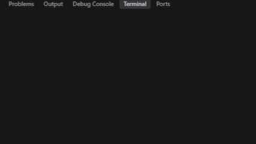

# 🎵 Let Down - Animated Lyrics (Radiohead)

Este proyecto es un script en **Python** que reproduce en la terminal una parte del tema  
**"Let Down" de Radiohead**, mostrando el estribillo con un efecto de escritura animada y pausas temporizadas que imitan el ritmo de la canción.  

---

## ✨ Características
- 🎨 Texto con colores en consola gracias a **colorama**.  
- ⏱️ Tiempos personalizados para simular el *timing* real de la canción.  
- ⌨️ Efecto de tipeo progresivo (carácter por carácter).  
- 💻 Compatible con **Windows, Linux y macOS**.  

---

## 🎬 Preview

---
